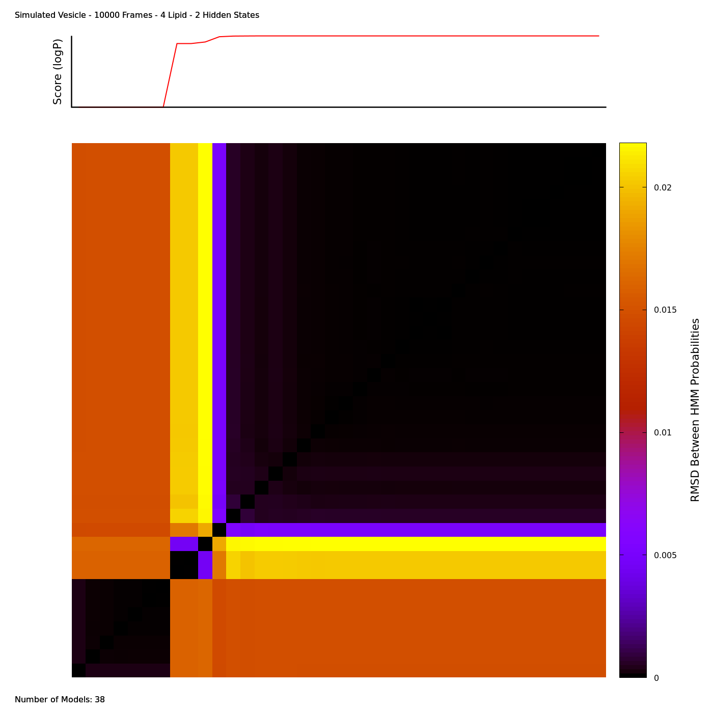

# vesicle-HMM-analysis

## Purpose

After gathering molecular dynamics (MD) trajectories of a biophysical simulation of a vesicle, further analysis can be done to distinguish hidden states, such as lipid ordered and disordered states. Consider a simplified vesicle of only the lipid head groups; a sample frame "example_frame.pdb" is given which can be visualized with a pre-made VMD tcl script:

```
vmd example_frame.pdb -e <(echo "source lookAtVesicle.tcl")
```


After simulating many consecutive frames of this mixture of lipids, it may be discernable to the human eye that small or medium sized domains now and then transiently form. To have a more concrete definition for these domains, a hidden markov state model (HMM) may be made to differentiate lipids of different domains (hidden states) through observation of key properties (obervable states) over time. The coordinates in the PDB files are sufficient to record a few key observables states, namely the local lipid composition (LCC).

## Local Lipid Composition

Each lipid has a number of "neighboring" lipids which it borders. This local lipid composition (LCC) varies in number (e.g. six neighbors for hexagonally-packed lipids) and composition (e.g. cholesterol-rich, POPC-rich). To simplify the diversity of LCCs, consider only the five closest lipids and the lipid itself; this composition of six lipid types can be uniquely assigned an integer value distinct from every other composition of six lipid types. Altogether, all LCCs can be described by one of 84 compositions, as is summarized in the figure below.


Each composition has some probability of occurring and are approximated by a Bernoulli multivariate distribution over the four lipid types for this vesicle in the figure above. For this vesicle's outer membrane's specific composition, these probabilities can be calculated and visualized as follows:

```
gfortran getBernoulliProbability.f90 -o getBernoulliProbability.o
./makeTetrahedronGraph.sh <(seq 0 6 | while read nO; do seq 0 6 | while read nP; do seq 0 6 | while read nN; do let "nC = 6 - ($nO + $nP + $nN)"; if [ "$nC" -ge "0" ]; then P=$(./getBernoulliProbability.out $nP $nN $nC $nO | awk '{print 100 * $1}'); echo "$nO $nP $nN $nC $P"; fi; done; done; done) bernoulli-triangle.png "Bernoulli Probability Distribution"
```

To use this observable for the HMM, coordinates from the PDB files must first be processed to record the LCC of each lipid as frames listed line-by-line as follows:

```
python BLAHBLAH example_frame.pdb > hmm-observables.txt
```

## Hidden Markov State Model

The full list of observables states of each lipid for all frames (here, not given due to the large size), can then be fed into a HMM. While any number of hidden states may be specified, by specifying two, less variables will be needed to optimize over while still differentiating between the two most distinct hidden states. This can be done with the "getHMManalysis.slurm" script after specifying the inputfile as:

```
hmminputfile=hmm-observables.txt
```

As this may take some time (an hour to test a single set of initial conditions), execution of this script is normally set up to be done in the background. When a number of different converged models are found with this (each from separate initial conditions), the output of the script "getHMManalysis.out" may be processed to compare the different models:

```
./compareHMModels.sh getHMManalysis.out HMMcomparison.png "4 Lipids - 2 Hidden States"
```

In this example, the output found twenty models before termination. These models are probability distributions and can be rudimentarily compared to one another by their root mean square deviation (RMSD). The score, as displayed in the figure below, is the logarithm of the probability that a model produced the sequence of observable states that were initially given. In this way, the highest-scoring model is the most-probable model. Low RMSD between the most-probable models is one indicator of model consensus agreement (and possible convergence to the global maximally-probable model).



The probabilities listed of the most-probable model in this script's output can the be copied to a separate file for further visualization by:

```
paste -d' ' <(seq 0 6 | while read nO; do seq 0 6 | while read nP; do seq 0 6 | while read nN; do let "nC = 6 - ($nO + $nP + $nN)"; if [ "$nC" -ge "0" ]; then echo " $nO $nP $nN $nC"; fi; done; done; done) <(echo "0.00027411 0.00319963 0.01374081 0.02787739 0.02773353 0.01284625 0.00212056 0.00062054 0.00585837 0.01878855 0.02700535 0.01702408 0.00368312 0.00063265 0.00453114 0.01040348 0.00953324 0.00282574 0.00036884 0.00185428 0.00278568 0.00112270 0.00012399 0.00041674 0.00028096 0.00002557 0.00003891 0.00000216 0.00228771 0.01951485 0.06226037 0.08509590 0.05112530 0.01075213 0.00400878 0.02771680 0.06240163 0.05456507 0.01523015 0.00302080 0.01528866 0.02187371 0.00891206 0.00120921 0.00386582 0.00248962 0.00026271 0.00036013 0.00002234 0.00638966 0.04191509 0.08971806 0.07304086 0.01937906 0.00581996 0.02740322 0.03713830 0.01410270 0.00176575 0.00562461 0.00368045 0.00027884 0.00042926 0.00001836 0.00178088 0.00776307 0.00958356 0.00339109 0.00046251 0.00135833 0.00081867 0.00004119 0.00005674 0.00000192 0.00001221 0.00002890 0.00001461 0.00000000 0.00000000 0.00000000 0.00000000 0.00000000 0.00000000 0.00000000" | xargs -n1) <(echo "0.00000000 0.00000000 0.00000000 0.00000000 0.00000000 0.00000000 0.00000000 0.00000000 0.00000000 0.00000000 0.00000000 0.00000000 0.00000000 0.00000021 0.00000100 0.00000280 0.00000288 0.00000024 0.00000080 0.00000305 0.00000417 0.00000227 0.00000106 0.00000234 0.00000097 0.00000026 0.00000013 0.00000004 0.00000898 0.00008859 0.00034130 0.00052287 0.00038080 0.00009978 0.00011866 0.00079699 0.00197101 0.00187130 0.00061343 0.00032845 0.00153244 0.00219801 0.00094045 0.00031059 0.00083175 0.00053894 0.00009536 0.00012105 0.00000744 0.00222952 0.01533205 0.03586277 0.03254024 0.00978296 0.00732689 0.03605003 0.05239727 0.02179139 0.00668172 0.02052519 0.01369135 0.00241198 0.00324667 0.00025528 0.01807147 0.08608292 0.11836996 0.04599063 0.02438917 0.07514428 0.04837773 0.01162114 0.01688539 0.00178249 0.02636081 0.07980922 0.04903579 0.02607889 0.03613792 0.00639244 0.01747535 0.02394488 0.01010938 0.00407442" | xargs -n1) > hmm-model1-distribution.dat
```

Similar to the Bernoulli probabilities, these distributions can be visualized on a tetrahedron. To emphasize their difference, their differences can be plotted on a similar tetrahedron with the "makeDeltaTetrahedronGraph.sh" script, as follows:

```
./makeTetrahedronGraph.sh <(grep -v '^#' hmm-model1-distribution.dat | awk '{print $1, $2, $3, $4, 100*$5}') hmm-model1-distribution-state1.png "Hidden State 1 Probability Distribution"
./makeTetrahedronGraph.sh <(grep -v '^#' hmm-model1-distribution.dat | awk '{print $1, $2, $3, $4, 100*$6}') hmm-model1-distribution-state2.png "Hidden State 2 Probability Distribution"
./makeDeltaTetrahedronGraph.sh <(grep -v '^#' 4lipid-system-timeaverage.dat) <(grep -v '^#' hmm-model1-distribution.dat) hmm-model1-hiddenstates.png "HMM 2-State Comparison, Outer Membrane"
```


## Viterbi Most Probable Hidden States

The Viterbi algorithm can then be used again to calculate the most-probable sequence of hidden states of each lipid, using the most-probable model stored in the output. This can be done with the "getHMMmostProbableStates.slurm" script after specifying the output from the previous script as:

```
hmmanalysisfile=getHMManalysis.out
```
