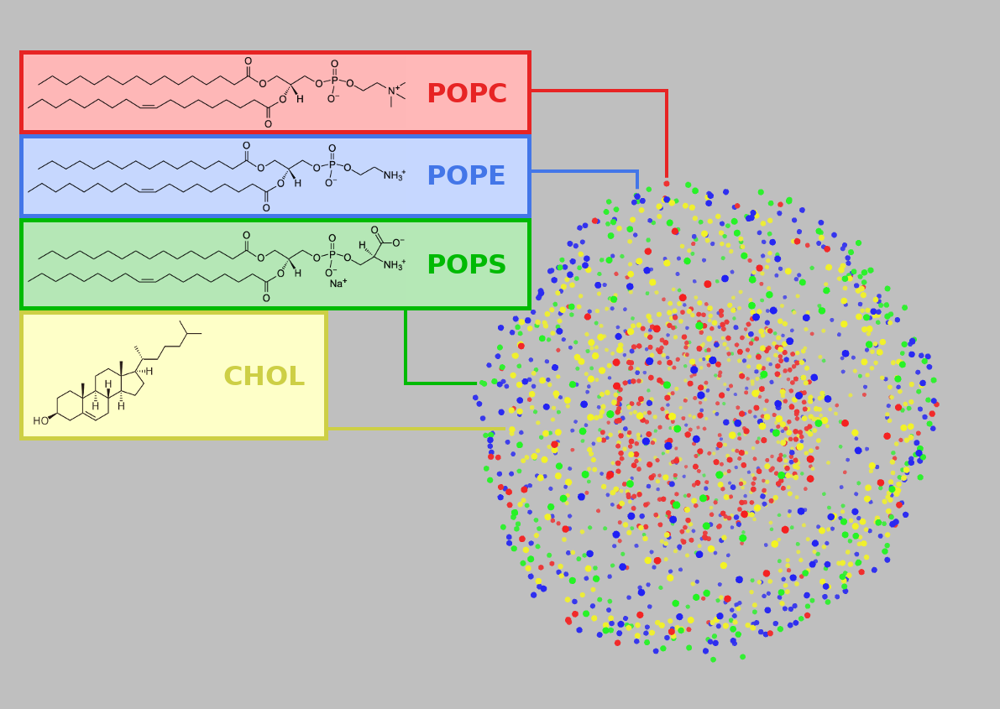

Visualizing The Vesicle
=======================

Visualizing arbitrary frames of the vesicle trajectory can be insightful for discovering new phenomena, as well as just being an easy check to see if the simulation is behaving physically. Included in this analysis are two visualization tools:

  1. VMD tcl scripting
  2. gnuplot scripting
  
VMD tcl Scripting
-----------------

Opening the trajectory in VMD is good for detailed investigation of the vesicle's topography as this renders the vesicle as a 3D interactable scene. Loading an entire trajectory allows for creation of 3D animations.

Settings to control how points (e.g. phospholipid heads) are rendered can be store in a tcl script such as ``lookAtVesicle.tcl`` and reused later. For a frame, ``example_frame.pdb``, for instance, VMD can open the file, load the settings, and display using this command:

.. code-block::

  vmd example_frame.pdb -e <(echo "source lookAtVesicle.tcl")

.. seealso::

   `Using VMD <https://www.ks.uiuc.edu/Training/Tutorials/vmd/tutorial-html/>`_
      A tutorial for VMD and tcl scripting

gnuplot Scripting
-----------------

Projecting the vesicle onto a map as a 2D image with gnuplot is good for creating easy-to-share graphics. Doing this for many consecutive frames allows for creation of 2D animations.
